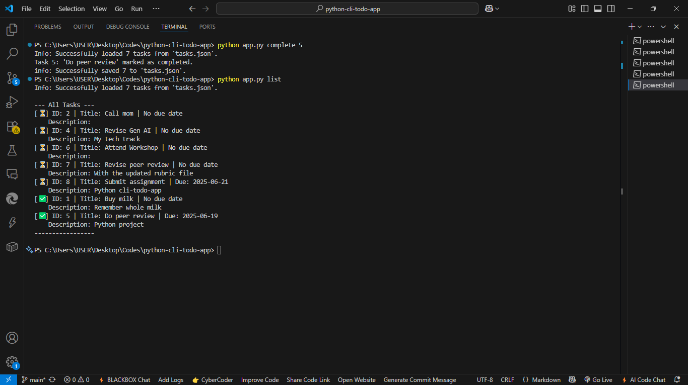
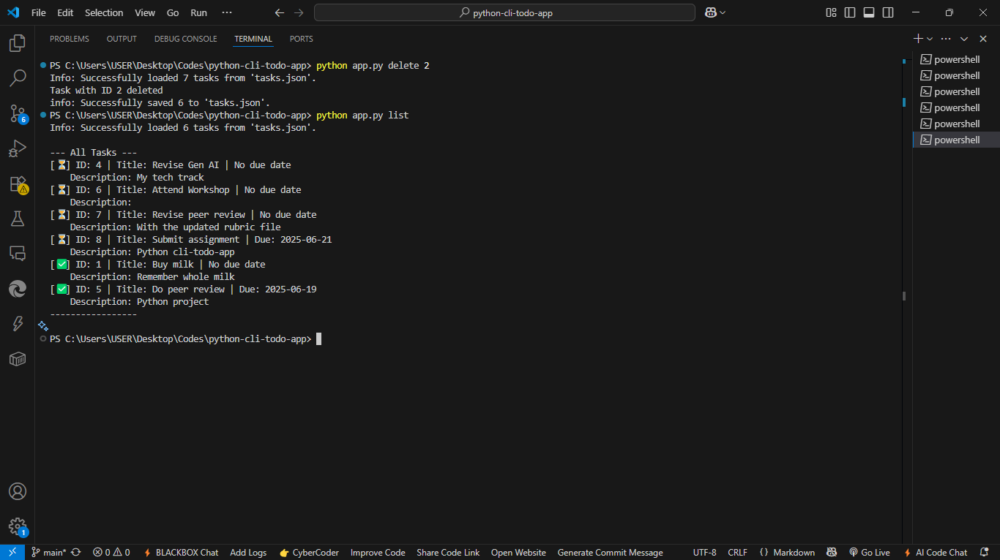
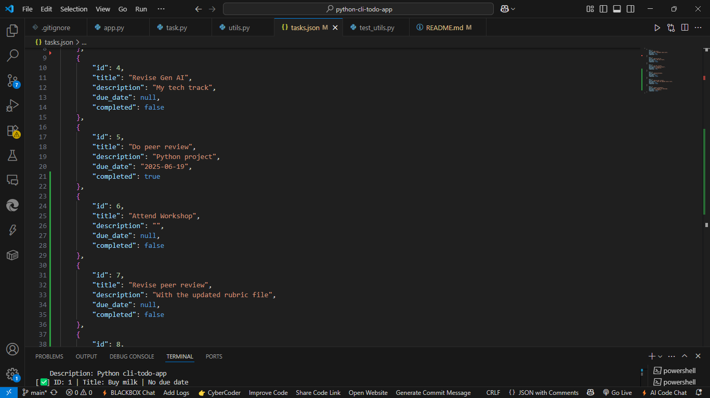

# Python CLI To-Do Application

## Project Description

This is a simple command-line interface (CLI) To-Do application built with Python. It allows users to manage their tasks directly from the terminal, including adding new tasks, listing existing ones, marking tasks as complete, and deleting them. All tasks are persisted to a `tasks.json` file, so your tasks are saved even after closing the application.

## Features

* **Add Tasks:** Add new tasks with a title, optional description, and optional due date.
    * `python app.py add "Task Title"`
    * `python app.py add "Task Title" -d "Task description"`
    * `python app.py add "Task Title" --due YYYY-MM-DD`
    * `python app.py add "Task Title" -d "Description" --due YYYY-MM-DD`

        


* **List Tasks:** View all tasks, showing their ID, title, description, due date, and completion status.
    * `python app.py list`

        

* **List Tasks Due Today:** Filter and display only pending tasks that are due on the current day.
    * `python app.py list --today`

        

* **Complete Tasks:** Mark a task as completed using its unique ID.
    * `python app.py complete <task_id>`

        

* **Delete Tasks:** Permanently remove a task using its unique ID.
    * `python app.py delete <task_id>`

        

* **Data Persistence:** Tasks are automatically saved to and loaded from `tasks.json`.
        

* **Robust Error Handling:** Gracefully handles non-existent or corrupted data files.

## Installation

To set up and run this project locally, follow these steps:

1.  **Clone the repository:**
    ```bash
    git clone [https://github.com/nutnell/python-cli-todo-app.git](https://github.com/nutnell/python-cli-todo-app.git)
    cd python-cli-todo-app
    ```
    

2.  **Create and activate a Python virtual environment (recommended):**
    ```bash
    python -m venv venv
    # On macOS/Linux:
    source venv/bin/activate
    # On Windows:
    venv\Scripts\activate.bat
    ```

3.  **No external dependencies:** This project uses only Python's standard library. No `pip install` commands are necessary beyond `pip install --upgrade pip` for good measure.

## Usage

Once installed and the virtual environment is activated, you can run the application using `python app.py` followed by the desired command and its arguments.

**General Help:**
```bash
python app.py --help
